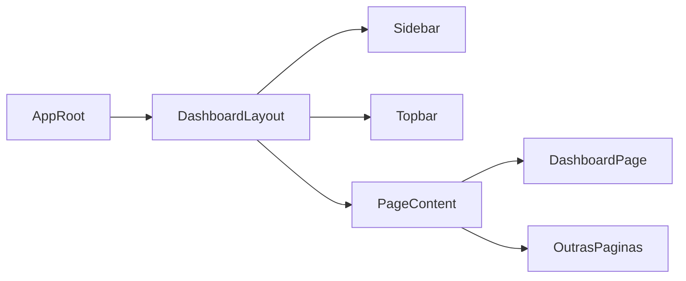

## Objetivo

**Aplicar o design system do shadcn/ui no front React (Vite)**, reestruturando o layout para um dashboard com **sidebar fixa + topbar**, usando componentes shadcn para cartões, tabelas, formulários e navegação, e removendo estilos ad-hoc que conflitem com as regras da skill.

## Arquitetura de Layout

- **Criar layout base do app**
  - Definir um componente de layout principal (ex.: `AppLayout` ou `DashboardLayout`) em algo como `[client/src/layouts/DashboardLayout.jsx](client/src/layouts/DashboardLayout.jsx)`.
  - Estrutura sugerida (conceitual):
    - `Sidebar` shadcn (navegação principal, logo, links de seções).
    - `Topbar` com título da página atual, ações rápidas e perfil/usuário.
    - Área de conteúdo com **grid de `Card`s** para métricas/ações principais.
- **Wireframe em alto nível**

## Integração com shadcn/ui (sem comandos ainda)

- **Verificar componentes disponíveis**
  - Assumir que o projeto já foi inicializado com shadcn (via MCP/skill) e que há `components.json` + pasta `ui` (ex.: `client/src/components/ui`).
  - Mapear quais destes componentes usar prioritariamente:
    - `Sidebar`, `Card`, `Button`, `Badge`, `Table`, `Tabs`, `FieldGroup`, `Field`, `Input`, `Separator`.
- **Desenhar composição dos componentes para o dashboard**
  - DashboardPage (já existente em `[client/src/pages/DashboardPage.jsx](client/src/pages/DashboardPage.jsx)`):
    - Substituir containers `div` soltos por `Card` com `CardHeader`/`CardTitle`/`CardContent`/`CardFooter`.
    - Usar `Badge` para status e variação de números em vez de `span` customizada.
    - Onde houver listagens simples, considerar `Table` shadcn.

## Ajustes de Layout e Estilo

- **Aplicar grid e spacing padrão**
  - Usar `flex` + `gap-`* para empilhamento vertical/horizontal (seguindo a skill, sem `space-y-`*).
  - Definir um grid responsivo para cards do dashboard (ex.: 1 coluna no mobile, 2–3 em telas maiores) com Tailwind.
- **Topbar e navegação**
  - Implementar `Topbar` com:
    - Título da página, breadcrumb simples (se fizer sentido) com `Breadcrumb` shadcn.
    - Ações principais como `Button` de adicionar/filtrar.
- **Padronização de cores e tipografia**
  - Trocar utilitários de cor “crus” (`text-emerald-600`, etc.) por **tokens semânticos** (`text-muted-foreground`, `bg-primary`, `bg-background`).
  - Remover overrides manuais de dark mode, confiando nos tokens globais configurados pelo shadcn.

## Refatoração de Páginas Principais

- **Dashboard**
  - Envolver `DashboardPage` no novo `DashboardLayout`.
  - Quebrar seções grandes em subcomponentes (ex.: `StatsCards`, `RecentReceiptsTable`, `ShortcutsSection`) usando `Card` e `Table`.
- **Outras páginas (após dashboard)**
  - Criar um padrão de página básica (ex.: `PageContainer` dentro do layout) usando `Card` para conteúdo principal e `Separator` entre seções.
  - Migrar formulários maiores para `FieldGroup` + `Field` conforme as regras de forms da skill.

## Boas práticas específicas da skill shadcn

- **Regras que vou seguir ao ajustar o layout**
  - `className` apenas para layout (flex, grid, gap, margin) e não para redefinir cor/tipografia de componentes shadcn.
  - Sempre usar composição completa de `Card` e agrupar itens nos `Group` corretos (Tabs, Select, etc.).
  - Usar `Badge`, `Alert`, `Empty`, `Skeleton` em vez de divs customizadas quando aplicável.

## Entregáveis esperados

- **Novo layout de dashboard** com sidebar fixa e topbar funcionando, integrando `DashboardPage` dentro dele.
- **DashboardPage refatorada** para usar `Card`s, `Badge`s e, se aplicável, `Table` shadcn no lugar de marcação custom.
- **Padrão de layout reutilizável** para outras páginas, pronto para ser aplicado nas demais rotas da aplicação.

