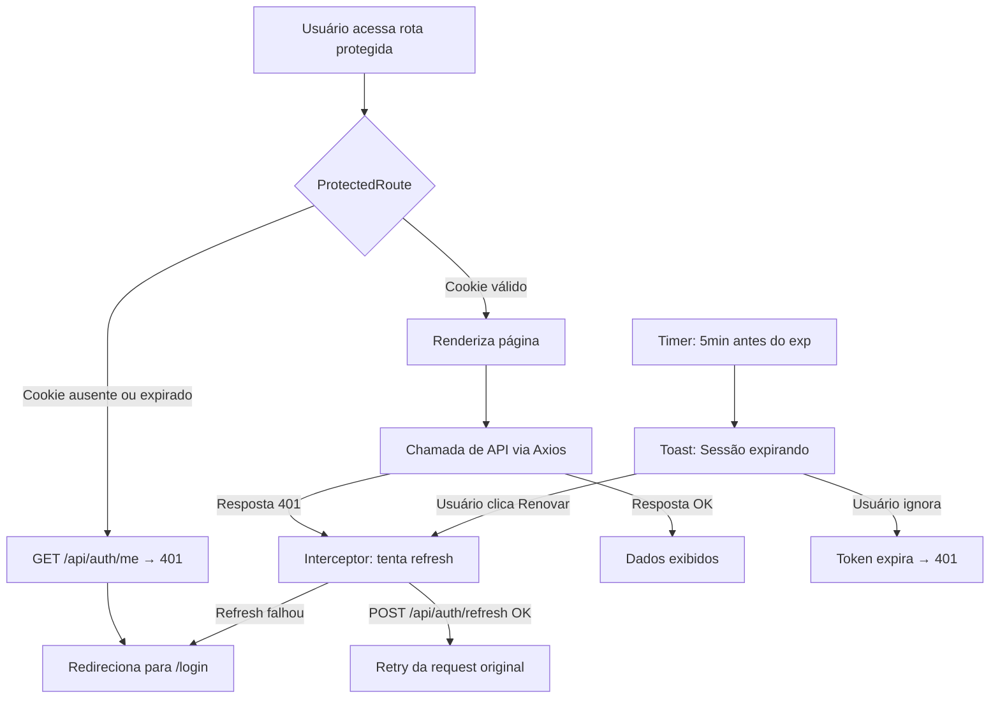
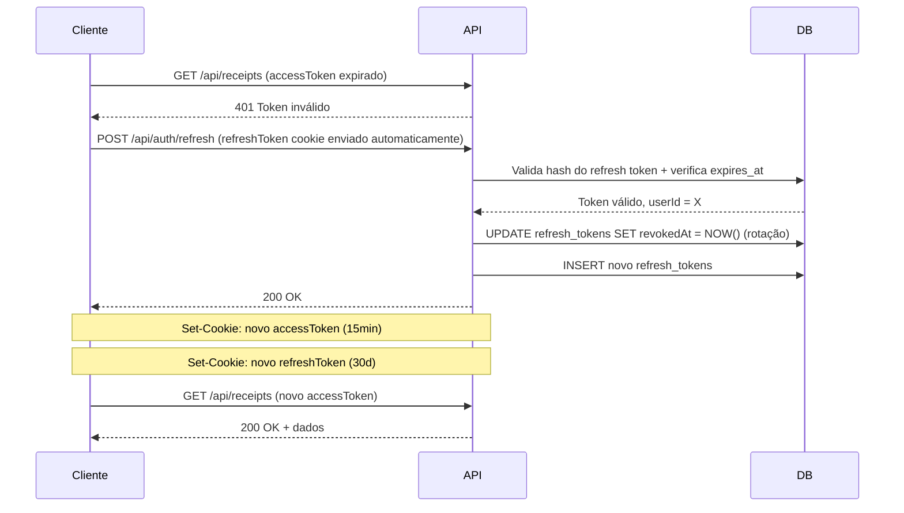

# TDD - Gerenciamento de Sessão JWT e Tratamento de Token Expirado

| Campo         | Valor                                        |
| ------------- | -------------------------------------------- |
| Tech Lead     | @tiagorv0                                    |
| Time          | Tiago Vazzoller                              |
| Epic/Ticket   | N/A                                          |
| Status        | Draft                                        |
| Criado        | 2026-03-22                                   |
| Atualizado    | 2026-03-22                                   |

---

## Contexto

O ReceipTV é uma aplicação web de gerenciamento de recibos financeiros com extração via IA. O sistema utiliza autenticação baseada em JWT (JSON Web Tokens) emitidos pelo backend Express e atualmente armazenados no `localStorage` do navegador. O token tem validade de 7 dias.

**Estado atual:** O processo de autenticação funciona para o fluxo inicial de login. Porém, o sistema possui diversas fragilidades: quando o token expira, o frontend entra em estado inconsistente resultando em tela preta; tokens ficam armazenados no `localStorage` (vulnerável a XSS); não há mecanismo de renovação silenciosa de sessão; o logout não invalida o token no servidor; e não há sincronização de sessão entre abas abertas.

**Domínio:** Autenticação e gerenciamento de sessão de usuário.

**Stakeholders:** Usuários finais do sistema, desenvolvedor responsável (Tiago).

---

## Definição do Problema e Motivação

### Problemas Identificados

- **Tela preta após inatividade prolongada:** Quando o token JWT expira, o usuário acessa a aplicação e encontra uma tela preta. O `ProtectedRoute` verifica apenas a existência do token no `localStorage`, não sua validade. Não há interceptor de resposta no Axios para tratar erros 401.
  - Impacto: Experiência completamente quebrada — o usuário precisa limpar manualmente o `localStorage`.

- **Ausência de redirecionamento automático ao login:** Após uma chamada de API retornar 401, o frontend não trata o erro de autenticação de forma centralizada.
  - Impacto: Falha silenciosa, degradando a confiança do usuário na aplicação.

- **Token armazenado em localStorage:** Acessível via JavaScript, exposto a ataques XSS.
  - Impacto: Superfície de ataque desnecessária para roubo de credenciais de sessão.

- **Sem renovação silenciosa de sessão:** O usuário precisa fazer login novamente a cada 7 dias, mesmo que use a aplicação diariamente.
  - Impacto: Fricção desnecessária para usuários ativos.

- **Logout sem invalidação server-side:** Após logout, o token permanece válido até expirar. Se for interceptado, pode ser usado indevidamente.
  - Impacto: Risco de segurança e impossibilidade de revogar sessões comprometidas.

- **Logout ineficiente e sem sincronização:** O fluxo de logout usa `window.location.reload()` e não notifica outras abas abertas.
  - Impacto: UX degradada e estado inconsistente em múltiplas abas.

### Por Que Agora?

- O token de 7 dias já está expirando para usuários reais, tornando o problema de tela preta reproduzível e recorrente.
- Resolver apenas o sintoma (tela preta) sem endereçar as causas raiz (localStorage, sem refresh token, sem logout server-side) criaria débito técnico imediato.

### Impacto de Não Resolver

- **Usuários:** Tela preta recorrente; re-login forçado semanalmente; sessões não encerráveis em caso de comprometimento.
- **Técnico:** Acúmulo de tokens inválidos sem cleanup; ausência de camada centralizada de autenticação dificulta evoluções futuras.

---

## Escopo

### ✅ No Escopo (V1)

**Frontend:**
- Adicionar interceptor de resposta no Axios para capturar erros 401 e redirecionar para `/login`
- Validar expiração do token no `ProtectedRoute` via decodificação do payload JWT
- Corrigir fluxo de logout para usar React Router `navigate` em vez de `window.location.reload()`
- Exibir mensagem contextual no login quando a sessão expirou
- Migrar armazenamento de token de `localStorage` para cookies HTTP-only (gerenciados pelo browser)
- Remover injeção manual do header `Authorization` no interceptor de request do Axios (cookie enviado automaticamente)
- Implementar aviso proativo de expiração de sessão (toast/banner com ação de renovar)
- Implementar sincronização de logout entre abas via `BroadcastChannel`

**Backend:**
- Reduzir validade do access token de 7 dias para 15 minutos
- Emitir token via `Set-Cookie` com flags `HttpOnly`, `Secure` e `SameSite=Strict`
- Implementar endpoint `POST /api/auth/refresh` para renovação silenciosa via refresh token
- Implementar endpoint `POST /api/auth/logout` para invalidação do refresh token e limpeza do cookie
- Implementar endpoint `GET /api/auth/me` para verificação de sessão ativa
- Adaptar middleware de autenticação para ler token do cookie em vez do header `Authorization`
- Adicionar proteção CSRF para requisições de mutação
- Adicionar campo `jti` (JWT ID) nos tokens emitidos

**Banco de Dados:**
- Criar tabela `refresh_tokens` para armazenamento seguro (hash) dos refresh tokens

### ❌ Fora do Escopo (V1)

- Invalidação server-side de access tokens via blocklist (Redis/banco) — com access tokens de 15 minutos, o risco residual é aceitável
- "Deslogar de todos os dispositivos" (revogação de todos os refresh tokens do usuário)
- Multi-region / sessão federada

### Considerações Futuras (V2+)

- Blocklist de access tokens via Redis para revogação imediata
- "Deslogar de todos os dispositivos"
- Autenticação social (OAuth — Google, GitHub)

---

## Solução Técnica

### Visão Geral da Arquitetura

A solução endereça autenticação em três camadas: armazenamento seguro de credenciais (cookies HTTP-only), renovação silenciosa de sessão (refresh token), e experiência de usuário resiliente (interceptor, aviso, sincronização entre abas).



### Fluxo de Login e Emissão de Tokens

```mermaid
sequenceDiagram
    participant Cliente
    participant API
    participant DB

    Cliente->>API: POST /api/auth/login { username, password }
    API->>DB: Valida credenciais
    DB-->>API: OK, userId = X
    API-->>Cliente: 200 OK
    Note over API,Cliente: Set-Cookie: accessToken=JWT(15min); HttpOnly; Secure; SameSite=Strict
    Note over API,Cliente: Set-Cookie: refreshToken=<opaque>(30d); HttpOnly; Secure; SameSite=Strict; Path=/api/auth/refresh
    API->>DB: INSERT refresh_tokens (hash, userId, expiresAt)
```

### Fluxo de Renovação Silenciosa (Refresh)



### Fluxo de Logout

```mermaid
sequenceDiagram
    participant Aba A
    participant API
    participant DB
    participant BroadcastChannel
    participant Aba B

    Aba A->>API: POST /api/auth/logout (refreshToken cookie)
    API->>DB: UPDATE refresh_tokens SET revokedAt = NOW()
    API-->>Aba A: 204 No Content + Set-Cookie: accessToken=; Max-Age=0
    Aba A->>BroadcastChannel: postMessage({ type: 'logout' })
    Aba A->>Aba A: navigate('/login')
    BroadcastChannel->>Aba B: onmessage({ type: 'logout' })
    Aba B->>Aba B: navigate('/login')
```

### Novos Endpoints de API

| Endpoint | Método | Descrição | Request | Response |
|----------|--------|-----------|---------|----------|
| `/api/auth/refresh` | POST | Renova access token via refresh token (cookie) | — (cookie automático) | `204 No Content` + novo cookie |
| `/api/auth/logout` | POST | Revoga refresh token e limpa cookies | — (cookie automático) | `204 No Content` |
| `/api/auth/me` | GET | Retorna dados do usuário autenticado | — (cookie automático) | `{ id, username }` ou `401` |

**Endpoints existentes sem alteração de contrato** (apenas a leitura do token muda de header para cookie):

| Endpoint | Mudança |
|----------|---------|
| `POST /api/auth/login` | Passa a emitir `Set-Cookie` em vez de retornar `token` no body |
| Todas as rotas protegidas | Middleware lê token do cookie em vez do header |

### Schema do Banco de Dados

**Nova tabela `refresh_tokens`:**

| Campo | Tipo | Constraints |
|-------|------|-------------|
| `id` | SERIAL | PRIMARY KEY |
| `user_id` | INTEGER | FK → `users.id`, NOT NULL |
| `token_hash` | VARCHAR(64) | NOT NULL (SHA-256 do token bruto) |
| `expires_at` | TIMESTAMPTZ | NOT NULL |
| `revoked_at` | TIMESTAMPTZ | NULL (NULL = válido) |
| `created_at` | TIMESTAMPTZ | NOT NULL DEFAULT NOW() |

Índices: `(user_id)`, `(token_hash)` (para lookup na validação), `(expires_at)` (para job de limpeza).

**Nenhuma alteração nas tabelas existentes.**

### Estrutura do Access Token JWT (atualizada)

```json
{
  "jti": "550e8400-e29b-41d4-a716-446655440000",
  "id": 1,
  "username": "usuario",
  "iat": 1700000000,
  "exp": 1700000900
}
```

Campo `jti` adicionado para identificação única do token (necessário para futura blocklist na V2).

### Componentes Impactados

| Componente | Responsabilidade na Solução |
|------------|----------------------------|
| `server/routes/auth.js` | Emitir tokens via Set-Cookie; novos endpoints refresh, logout, me |
| `server/middleware/auth.js` | Ler token do cookie em vez do header Authorization |
| `server/config/database.js` | Nenhuma mudança |
| `migrate.js` + novo arquivo de migration | Criar tabela `refresh_tokens` |
| `client/src/api/index.js` | Remover interceptor de request (header); adicionar interceptor de resposta com retry via refresh; `withCredentials: true` |
| `client/src/components/ProtectedRoute.jsx` | Verificar sessão via `GET /api/auth/me` em vez de localStorage |
| `client/src/components/Sidebar.jsx` | Chamar `POST /api/auth/logout` + emitir evento BroadcastChannel |
| `client/src/components/SessionExpiryWarning.jsx` (novo) | Timer baseado no `exp` do token; toast de aviso; ação de renovar |
| `client/src/hooks/useSessionSync.js` (novo) | Subscrição ao BroadcastChannel para sincronização entre abas |
| `client/src/pages/LoginPage.jsx` | Exibir mensagem de sessão expirada |
| `client/src/App.jsx` ou `Layout.jsx` | Montar `SessionExpiryWarning` e `useSessionSync` globalmente |

---

## Considerações de Segurança

### Armazenamento de Tokens

- **Access token:** Cookie HTTP-only — não acessível via JavaScript, eliminando o vetor de roubo por XSS.
- **Refresh token:** Cookie HTTP-only com `Path=/api/auth/refresh` — enviado apenas para o endpoint de renovação, minimizando a exposição.
- **Flags obrigatórias nos cookies:** `HttpOnly`, `Secure` (HTTPS apenas), `SameSite=Strict`.

### Refresh Token

- Armazenado no banco apenas como hash SHA-256 — o valor bruto nunca é persistido.
- Rotação a cada uso: a cada renovação, o refresh token antigo é revogado e um novo é emitido.
- Detecção de reutilização: se um refresh token já revogado for apresentado, todos os tokens do usuário devem ser revogados (indicativo de comprometimento).

### Proteção CSRF

Cookies com `SameSite=Strict` protegem contra CSRF na maioria dos cenários. Como medida adicional para requisições de mutação críticas (logout, refresh):
- O cliente envia um header customizado (ex: `X-Requested-With: XMLHttpRequest`)
- O servidor rejeita requisições sem esse header nas rotas de autenticação

### Validação de Token no Cliente

- O `ProtectedRoute` não decodifica o JWT para autorização — chama `GET /api/auth/me` para verificar sessão via cookie.
- A verificação real ocorre no backend via `jwt.verify()` com `JWT_SECRET`.
- O aviso proativo de expiração pode decodificar o payload para calcular o tempo restante (apenas para UX, sem implicação de segurança).

### Práticas Aplicadas

- Access token com validade curta (15 minutos) limita a janela de comprometimento
- Nenhuma credencial ou token é logado
- Refresh token não é retornado no body da resposta, apenas via Set-Cookie
- Endpoint `/api/auth/refresh` aceita apenas o cookie — nunca token no body ou header

---

## Riscos

| Risco | Impacto | Probabilidade | Mitigação |
|-------|---------|---------------|-----------|
| Loop de renovação: interceptor 401 tenta refresh que também retorna 401 | Alto | Médio | Flag `_retry` na config da request; após 1 tentativa de refresh falhar, redirecionar para login sem novo retry |
| Múltiplas requests simultâneas tentando renovar o token ao mesmo tempo | Alto | Médio | Serializar renovação com promise compartilhada: primeira request inicia o refresh, demais aguardam o mesmo promise |
| Reutilização de refresh token revogado (token roubado) | Alto | Baixo | Detectar reutilização e revogar toda a sessão do usuário |
| CORS mal configurado expõe cookies entre origens | Alto | Baixo | Definir `origin` explícito no CORS (nunca `*`); `credentials: true` |
| `BroadcastChannel` não suportado em Safari mais antigo | Baixo | Baixo | Fallback via `storage event` no `localStorage` para comunicação entre abas |
| Migração da tabela `refresh_tokens` falha em produção | Médio | Baixo | Testar migration em ambiente de staging antes de produção; ter script de rollback (DROP TABLE) |
| Clock skew entre cliente e servidor para o aviso de expiração iminente | Baixo | Baixo | Margem de 30s na verificação de `exp` no cliente |

---

## Plano de Implementação

| Fase | Tarefa | Descrição | Status | Estimativa |
|------|--------|-----------|--------|------------|
| **Fase 1 — Backend: Banco** | Migration `refresh_tokens` | Criar script de migration e tabela no banco | TODO | 1h |
| **Fase 2 — Backend: Auth** | Adaptar emissão de tokens | Login emite access (15min) + refresh (30d) via Set-Cookie; adicionar campo `jti` | TODO | 2h |
| | Middleware lê cookie | Adaptar `auth.js` para ler token de `req.cookies` | TODO | 1h |
| | Endpoint `POST /api/auth/refresh` | Validar refresh token (hash, expiração, revogação), emitir novos tokens com rotação | TODO | 3h |
| | Endpoint `POST /api/auth/logout` | Revogar refresh token no banco e limpar cookies | TODO | 1h |
| | Endpoint `GET /api/auth/me` | Retornar dados do usuário autenticado pelo cookie | TODO | 30min |
| **Fase 3 — Frontend: Core** | Axios: `withCredentials` + interceptor 401 | Remover header Authorization; adicionar `withCredentials: true`; interceptor captura 401, tenta refresh e faz retry; caso refresh falhe, redireciona para login | TODO | 3h |
| | `ProtectedRoute` via `/api/auth/me` | Substituir verificação de localStorage por chamada a `/api/auth/me` | TODO | 1h |
| | Logout refatorado | Chamar `POST /api/auth/logout`; navegar via React Router | TODO | 1h |
| | Mensagem de sessão expirada | Exibir aviso no `LoginPage` quando redirect veio de sessão expirada | TODO | 30min |
| **Fase 4 — Frontend: UX** | `SessionExpiryWarning` | Componente com timer baseado no `exp` do cookie; toast de aviso 5min antes; ação de renovar chama o interceptor de refresh | TODO | 2h |
| | `useSessionSync` (BroadcastChannel) | Hook que emite evento `logout` ao deslogar e ouve eventos de outras abas | TODO | 1h |
| **Fase 5 — Testes** | Testes manuais | Cobrir todos os cenários de aceitação listados | TODO | 2h |

**Estimativa Total:** ~18 horas (~2,5 dias)

**Dependências:**
- Fase 2 depende da Fase 1 (tabela deve existir antes do endpoint de refresh)
- Fase 3 depende da Fase 2 (frontend precisa dos endpoints prontos para testar)
- Fase 4 é independente da Fase 3 e pode ser desenvolvida em paralelo
- Fase 5 depende de todas as anteriores

---

## Estratégia de Testes

| Tipo | Escopo | Cenários |
|------|--------|----------|
| **Teste Manual** | Sessão expirada ao abrir o app | Expirar cookie manualmente via DevTools → verificar redirect para `/login` com mensagem |
| **Teste Manual** | Renovação silenciosa via refresh | Expirar o access token (reduzir `exp` via proxy/DevTools) → fazer ação → verificar que a request foi renovada e respondida sem interrupção |
| **Teste Manual** | Refresh token expirado | Expirar ambos os tokens → verificar redirect para `/login` |
| **Teste Manual** | Loop de 401 no interceptor | Verificar que `/api/auth/login` e `/api/auth/refresh` não disparam novo refresh ao retornar 401 |
| **Teste Manual** | Múltiplas requests simultâneas com token expirado | Abrir duas abas de dados ao mesmo tempo com token expirado → verificar que apenas 1 request de refresh é feita |
| **Teste Manual** | Logout e sincronização entre abas | Logout em uma aba → verificar que outras abas abertas são redirecionadas para `/login` |
| **Teste Manual** | Aviso proativo de expiração | Configurar token com `exp` em 6 minutos → verificar aparecimento do toast após ~1 minuto |
| **Teste Manual** | Ação "Renovar" no aviso | Clicar em "Renovar" no toast → verificar que novos cookies são emitidos e o timer reinicia |
| **Teste Manual** | Cookie HTTP-only não acessível | `document.cookie` no console não deve exibir os tokens |
| **Teste Manual** | CORS com credenciais | Verificar que requests cross-origin sem credenciais são rejeitadas pelo servidor |

### Cenários de Aceitação

- ✅ Usuário com cookie expirado abre o site → redirecionado para `/login` com mensagem
- ✅ Token expira durante o uso → próxima ação renova silenciosamente sem interrupção
- ✅ Refresh token expirado → redirecionado para `/login`
- ✅ Logout em uma aba redireciona todas as abas abertas para `/login`
- ✅ Toast de aviso aparece 5 minutos antes da expiração do access token
- ✅ `document.cookie` no console do browser não exibe os tokens de autenticação
- ✅ Logout invalida o refresh token no banco — reutilização retorna 401

---

## Métricas de Sucesso

| Métrica | Alvo | Como Medir |
|---------|------|------------|
| Tela preta para usuários com sessão expirada | Zero ocorrências | Testes manuais + feedback de usuário |
| Renovação silenciosa sem interrupção do usuário | 100% das renovações transparentes | Testes manuais observando o fluxo de rede |
| Tokens inacessíveis via JavaScript | 100% | `document.cookie` + DevTools Application → Cookies |
| Sincronização de logout entre abas | 100% | Teste manual com múltiplas abas |

---

## Questões em Aberto

| # | Questão | Contexto | Status |
|---|---------|----------|--------|
| 1 | Como `SessionExpiryWarning` acessa o `exp` do access token se o cookie é HTTP-only? | Opções: (a) backend retorna o `exp` no body do login/refresh para o frontend armazenar em memória; (b) criar cookie não HTTP-only apenas com o timestamp de expiração (não o token em si) | Aberto |
| 2 | Validade do refresh token: 30 dias ou valor diferente? | 30 dias é padrão razoável; pode ser configurável por ambiente | Aberto |
| 3 | Rotação de refresh token: sempre ou apenas quando próximo da expiração? | Rotação a cada uso é mais segura mas gera mais writes no banco | Aberto |
| 4 | Job de limpeza de refresh tokens expirados: quando e como? | Opções: (a) cron job no servidor; (b) cleanup on-demand na validação; (c) TTL automático se usar Redis futuro | Aberto |

---

## Plano de Rollback

### Triggers de Rollback

- Loop de redirecionamento para `/login` durante uso normal
- Usuários autenticados sendo deslogados inesperadamente (falso positivo)
- Falha na migration do banco em produção

### Passos de Rollback

**Frontend (instantâneo):**
1. Reverter arquivos modificados via `git revert` ou `git checkout`
2. O frontend volta a usar `localStorage` e o header `Authorization`

**Backend (requer atenção):**
1. Reverter endpoints e middleware
2. Voltar a emitir token no body do response (não mais via cookie)
3. Restaurar validade do access token para 7 dias

**Banco de Dados:**
1. Executar down migration: `DROP TABLE IF EXISTS refresh_tokens`
2. Nenhuma coluna foi adicionada a tabelas existentes — rollback não afeta dados de usuários ou recibos

**Nota:** O rollback de banco é destrutivo para os refresh tokens ativos, mas como o sistema voltará a usar access tokens de 7 dias no localStorage, os usuários simplesmente precisarão fazer login novamente — sem perda de dados de negócio.
