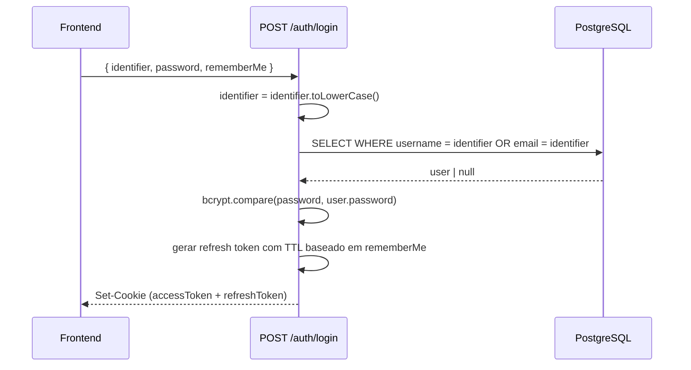

# TDD - Melhorias no Login e Cadastro

| Campo          | Valor                                          |
| -------------- | ---------------------------------------------- |
| Tech Lead      | @tiagorv0                                      |
| Equipe         | Tiago Vazzoller                                |
| Epic/Ticket    | feat/auth-improvements                         |
| Status         | Draft                                          |
| Criado         | 2026-03-26                                     |
| Última Atualização | 2026-03-26                                 |

---

## Contexto

O ReceipTV possui um sistema de autenticação com JWT via HTTP-only cookies, refresh token rotation e detecção de reuso. O fluxo atual suporta cadastro com username, email e senha, e login apenas por username + senha.

**Estado atual:**
- Login aceita somente `username` como identificador
- Username e email não são normalizados para lowercase no momento do cadastro ou login, podendo causar duplicatas ou inconsistências (ex: `Joao` e `joao` seriam usuários distintos)
- O token de sessão expira em 15 minutos (access token) com refresh automático por até 30 dias, mas não há distinção de duração entre "sessão temporária" e "continuar logado"

**Domínio:** Autenticação de usuários

**Stakeholders:** Usuários finais do ReceipTV

---

## Definição do Problema e Motivação

### Problemas que estamos resolvendo

- **Case-sensitivity no identificador:** Username e email não são normalizados, gerando potencial de duplicatas e frustração no login (ex: usuário cadastrado como `Joao` não consegue logar digitando `joao`)
  - Impacto: Erros de login desnecessários, má experiência do usuário

- **Login somente por username:** Usuários que não lembram o username, mas lembram o email, não conseguem autenticar
  - Impacto: Fricção no acesso, risco de abandono

- **Ausência de "continuar logado":** Todos os usuários têm a mesma duração de sessão (refresh token de 30 dias), sem controle explícito. Não há distinção entre "quero manter sessão" e "acesso temporário"
  - Impacto: Sem granularidade para segurança (ex: login em dispositivo compartilhado)

### Por que agora?

- O sistema de auth já está maduro o suficiente para receber esses refinamentos sem refatoração estrutural
- Os problemas de case-sensitivity ficam mais evidentes à medida que a base de usuários cresce

### Impacto de NÃO resolver

- **Usuários:** Frustração com login falhando por diferença de capitalização; impossibilidade de logar com email
- **Técnico:** Dados inconsistentes no banco (usernames duplicados com case diferente)

---

## Escopo

### ✅ Em Escopo (V1)

- Normalizar `username` e `email` para **lowercase** no momento do cadastro (backend)
- Normalizar o identificador de entrada para **lowercase** no momento do login (backend), antes de buscar no banco
- Permitir login com **email** como alternativa ao username (campo único aceita ambos)
- Adicionar opção **"Continuar logado"** no frontend do login
  - Quando marcado: duração do refresh token mantida em 30 dias (comportamento atual)
  - Quando não marcado: refresh token com duração de 1 hora (sessão de curta duração)
- Migração dos dados existentes: normalizar usernames e emails para lowercase no banco

### ❌ Fora de Escopo (V1)

- Login por redes sociais (OAuth/SSO)
- Autenticação de dois fatores (2FA)
- Recuperação de senha por email
- Múltiplos emails por usuário
- Renomear username existente pelo próprio usuário

### Considerações Futuras (V2+)

- Recuperação de senha ("esqueci minha senha")
- Troca de email vinculado à conta

---

## Solução Técnica

### Visão Geral da Arquitetura

As mudanças são cirúrgicas nos endpoints de `POST /api/auth/register` e `POST /api/auth/login`, na lógica de geração de refresh token, e na tela de login do frontend. Nenhuma nova tabela é necessária.



**Componentes envolvidos:**
- `server/routes/auth.js` — lógica de normalização, busca por email/username, TTL do refresh token
- `client/src/pages/LoginPage.jsx` — checkbox "Continuar logado", envio do campo `rememberMe`
- `client/src/api/services.js` — incluir `rememberMe` no payload do login
- Migração de dados — normalizar registros existentes

### Fluxo de Cadastro (Register)

1. Frontend envia `{ username, email, password }`
2. Backend normaliza: `username = username.toLowerCase()`, `email = email.toLowerCase()`
3. Verifica unicidade de username e email (já normalizados)
4. Persiste no banco com valores normalizados

### Fluxo de Login

1. Frontend envia `{ identifier, password, rememberMe }`
   - `identifier` pode ser username ou email
2. Backend normaliza: `identifier = identifier.toLowerCase()`
3. Busca usuário: `WHERE username = $1 OR email = $1`
4. Valida senha com bcrypt
5. Gera refresh token com TTL:
   - `rememberMe = true` → 30 dias (comportamento atual)
   - `rememberMe = false` → 1 hora
6. Retorna cookies `accessToken` (15min) e `refreshToken` (TTL definido acima)

### Contrato das APIs

**POST /api/auth/register**

```json
// Request (sem mudança na estrutura, apenas normalização interna)
{
  "username": "string",
  "email": "string",
  "password": "string"
}

// Response 201 Created (sem mudança)
{
  "message": "Usuário criado com sucesso"
}
```

**POST /api/auth/login**

```json
// Request — NOVO campo rememberMe
{
  "identifier": "string",   // aceita username OU email (campo renomeado de 'username')
  "password": "string",
  "rememberMe": false        // NOVO — boolean, default false
}

// Response 200 OK (sem mudança estrutural)
{
  "user": {
    "id": 1,
    "username": "joao",
    "email": "joao@email.com"
  }
}
// Set-Cookie: accessToken=...; HttpOnly
// Set-Cookie: refreshToken=...; HttpOnly (TTL varia conforme rememberMe)
```

### Mudanças no Banco de Dados

**Sem novas tabelas ou colunas.** A tabela `refresh_tokens` já possui `expires_at` — a mudança é apenas no valor inserido.

**Migração de dados existentes:**

- Normalizar `username` e `email` para lowercase em todos os registros da tabela `users`
- Estratégia: migration SQL com `UPDATE users SET username = LOWER(username), email = LOWER(email)`
- Risco de conflito: verificar duplicatas antes de executar (ex: se `Joao` e `joao` existirem)

```sql
-- Verificar duplicatas antes da migração
SELECT LOWER(username), COUNT(*) FROM users GROUP BY LOWER(username) HAVING COUNT(*) > 1;
SELECT LOWER(email), COUNT(*) FROM users GROUP BY LOWER(email) HAVING COUNT(*) > 1;
```

---

## Riscos

| Risco | Impacto | Probabilidade | Mitigação |
|-------|---------|---------------|-----------|
| Duplicatas de username/email após normalização | Alto | Baixo | Executar query de verificação antes da migration; resolver manualmente se houver conflito |
| Frontend enviando `username` em vez de `identifier` no campo renomeado | Médio | Médio | Manter compatibilidade aceitando ambos os campos no backend temporariamente; atualizar frontend e remover backward-compat depois |
| Usuário com sessão ativa tem refresh token longo sem ter marcado "continuar logado" | Baixo | Alto | Sessões existentes continuam funcionando normalmente; a mudança de TTL só afeta novos logins |
| Checkbox "continuar logado" ignorado pelo usuário (UX) | Baixo | Médio | Default `false` garante sessão curta por segurança; comportamento mais seguro por padrão |

---

## Plano de Implementação

| Fase | Tarefa | Descrição | Status | Estimativa |
|------|--------|-----------|--------|------------|
| **Fase 1 - Backend** | Normalização no register | Aplicar `.toLowerCase()` em username e email antes de inserir | TODO | 0.5h |
| | Login por identifier | Alterar query de busca para `WHERE username = $1 OR email = $1` com normalização | TODO | 1h |
| | rememberMe no login | Receber campo `rememberMe` e ajustar TTL do refresh token (30d vs 1h) | TODO | 1h |
| **Fase 2 - Migration** | Normalizar dados existentes | Script SQL para `LOWER(username)` e `LOWER(email)` em todos os usuários | TODO | 0.5h |
| **Fase 3 - Frontend** | Campo identifier no login | Renomear campo de `username` para `identifier` no formulário (label e state) | TODO | 0.5h |
| | Checkbox "Continuar logado" | Adicionar checkbox no form de login e incluir `rememberMe` no payload | TODO | 1h |
| | Atualizar serviço de API | Incluir `rememberMe` no `login()` em `services.js` | TODO | 0.5h |
| **Fase 4 - Testes** | Testes manuais | Validar todos os cenários descritos abaixo | TODO | 1h |

**Estimativa total:** ~6 horas

---

## Considerações de Segurança

**Sessão curta por padrão (`rememberMe = false`):**
- Refresh token expira em 1 hora — seguro para dispositivos compartilhados
- Usuário é deslogado automaticamente se inativo por mais de 1h sem marcar "continuar logado"

**Busca por email ou username:**
- A query usa parameterized statement (`WHERE username = $1 OR email = $1`) — sem risco de SQL injection
- Normalização ocorre no backend, não no banco — o índice `UNIQUE` em `username` e `email` já garante unicidade case-sensitive; após a migration, todos os valores serão lowercase

**Consideração LGPD:**
- O email já é coletado (migration 003) com propósito de autenticação — uso para login não representa nova coleta de PII

---

## Estratégia de Testes

| Cenário | Tipo | Resultado Esperado |
|---------|------|--------------------|
| Cadastro com username em maiúsculo → salva em lowercase | Manual/Integration | `username = "joao"` no banco |
| Cadastro com email em maiúsculo → salva em lowercase | Manual/Integration | `email = "joao@email.com"` no banco |
| Login com username em maiúsculo → autentica | Manual | Login bem-sucedido |
| Login com email válido → autentica | Manual | Login bem-sucedido |
| Login com email em maiúsculo → autentica | Manual | Login bem-sucedido |
| Login com identifier inválido → retorna 401 | Manual | `{ error: "Credenciais inválidas" }` |
| Login sem `rememberMe` → refresh token expira em 1h | Manual | Cookie `refreshToken` com `Max-Age` de 3600s |
| Login com `rememberMe: true` → refresh token expira em 30d | Manual | Cookie `refreshToken` com `Max-Age` de 2592000s |
| Migration: sem duplicatas no banco após normalização | SQL | Zero conflitos |

