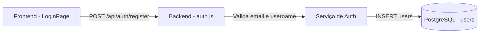

# TDD - Adição de Campo Email no Cadastro de Usuários

| Campo        | Valor                    |
|--------------|--------------------------|
| Tech Lead    | @Tiago Vazzoller         |
| Status       | Draft                    |
| Criado em    | 2026-03-22               |
| Atualizado   | 2026-03-22               |

---

## Contexto

O ReceipTV é um gerenciador de recibos financeiros com IA. Atualmente, o sistema de autenticação utiliza apenas `username` e `password` para cadastro e login. A tabela `users` no PostgreSQL não possui campo de email.

O domínio de autenticação precisa evoluir para suportar email como identificador único por usuário, o que é necessário para futuras funcionalidades como recuperação de senha e notificações.

---

## Definição do Problema

### Problemas que estamos resolvendo

- **Sem email no cadastro**: Não há forma de identificar ou contactar o usuário fora da plataforma. Impacto: impossibilidade de implementar recuperação de senha, notificações ou confirmação de conta.
- **Identificação fraca**: Apenas `username` como identificador não é suficiente para integrações futuras (ex: OAuth, serviços de email). Impacto: débito técnico crescente e retrabalho ao implementar essas features.

### Por que agora?

- Base de usuários ainda pequena — migração e adição da coluna têm baixo risco.
- Funcionalidades dependentes (recuperação de senha, notificações) estão no roadmap e bloqueadas por essa ausência.

### Impacto de não resolver

- **Técnico**: Impossibilidade de implementar recuperação de senha e notificações sem mudanças mais complexas futuramente.
- **Usuários**: Sem mecanismo de recuperação de acesso caso esqueçam a senha.

---

## Escopo

### ✅ Em Escopo (V1)

- Adicionar campo `email` à tabela `users` com constraint `UNIQUE NOT NULL`
- Validar formato de email no backend (regex básico)
- Retornar erro claro ao tentar cadastrar email já existente (409 Conflict)
- Adicionar campo de email no formulário de cadastro do frontend
- Incluir `email` no endpoint `POST /api/auth/register`
- Migration para adicionar a coluna `email` na tabela `users`

### ❌ Fora de Escopo (V1)

- Verificação/confirmação de email por link
- Recuperação de senha via email
- Login por email (mantém login por username)
- Notificações por email
- Alterar email após o cadastro

### Considerações futuras (V2+)

- Login com email como alternativa ao username
- Fluxo de confirmação de email
- Recuperação de senha

---

## Solução Técnica

### Visão geral

Adição da coluna `email` na tabela `users`, com validação no backend e no frontend, e atualização do endpoint de registro.



### Mudanças no Banco de Dados

**Tabela alterada:** `users`

| Campo  | Tipo          | Constraints          |
|--------|---------------|----------------------|
| email  | VARCHAR(255)  | UNIQUE, NOT NULL     |

- Index implícito via constraint UNIQUE no campo `email`
- Migration: adicionar coluna `email` com verificação prévia de existência (mesmo padrão do `server/migrate.js`)
- Usuários existentes: a coluna será adicionada com `NOT NULL` — se houver registros existentes, será necessário definir um valor padrão temporário ou migrar dados antes de aplicar a constraint

### API Contract

**Endpoint modificado:** `POST /api/auth/register`

```json
// Request Body (atualizado)
{
  "username": "tiago",
  "email": "tiago@email.com",
  "password": "senha123"
}

// Response 201 Created (sem alteração)
{
  "message": "User created",
  "userId": 1
}

// Response 409 Conflict (email duplicado)
{
  "error": "Email já cadastrado"
}

// Response 400 Bad Request (email inválido ou ausente)
{
  "error": "Email inválido"
}
```

### Fluxo de dados

1. Usuário preenche username, email e password no formulário de cadastro
2. Frontend envia `POST /api/auth/register` com os três campos
3. Backend valida formato do email (regex)
4. Backend insere na tabela `users` — banco rejeita se email duplicado (UNIQUE violation)
5. Backend mapeia o erro do banco para resposta 409 com mensagem clara
6. Frontend exibe feedback de erro ou redireciona ao dashboard

---

## Riscos

| Risco | Impacto | Probabilidade | Mitigação |
|-------|---------|---------------|-----------|
| Usuários existentes sem email bloqueiam a migration | Alto | Médio | Verificar se há registros antes de aplicar NOT NULL; usar valor padrão temporário se necessário |
| Frontend não valida email antes de enviar | Baixo | Alto | Adicionar validação HTML5 (`type="email"`) e validação no cliente antes do submit |
| Erro genérico ao tentar cadastrar email duplicado | Médio | Médio | Mapear `UNIQUE violation` (código `23505` do PostgreSQL) para retornar 409 com mensagem legível |

---

## Plano de Implementação

| Fase | Tarefa | Descrição | Status | Estimativa |
|------|--------|-----------|--------|------------|
| **Fase 1 - Banco** | Migration | Adicionar coluna `email VARCHAR(255) UNIQUE NOT NULL` à tabela `users` | TODO | 0.5d |
| **Fase 2 - Backend** | Validação | Adicionar validação de formato de email no endpoint de registro | TODO | 0.5d |
| **Fase 2 - Backend** | Tratamento de erro | Mapear UNIQUE violation do PG para 409 com mensagem amigável | TODO | 0.5d |
| **Fase 3 - Frontend** | Campo de email | Adicionar input de email no formulário de cadastro em `LoginPage.jsx` | TODO | 0.5d |
| **Fase 3 - Frontend** | Envio | Incluir `email` no payload enviado ao `register()` em `services.js` | TODO | 0.5d |
| **Fase 4 - Teste** | Smoke test | Testar cadastro feliz e cenários de erro (email inválido, duplicado) | TODO | 0.5d |

**Estimativa total:** ~3 dias

---

## Estratégia de Testes

| Tipo | Cenário | Esperado |
|------|---------|----------|
| Manual/Integration | Cadastro com email válido | 201 Created, usuário criado |
| Manual/Integration | Cadastro com email duplicado | 409 Conflict, mensagem clara |
| Manual/Integration | Cadastro com email inválido (sem @) | 400 Bad Request |
| Manual/Integration | Cadastro sem campo email | 400 Bad Request |
| Frontend | Input `type="email"` | Browser bloqueia formatos inválidos nativamente |

---

## Considerações de Segurança

- Email é PII — não deve ser logado em texto plano nos logs do Winston
- Email não deve ser retornado no token JWT ou no payload de login (a menos que necessário)
- Validação de formato deve ocorrer no backend independente do frontend (nunca confiar apenas no cliente)
- Usar queries parametrizadas (padrão já adotado no projeto) para evitar SQL injection
