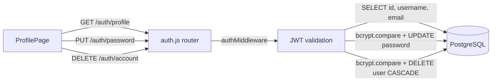

# TDD — Página de Perfil do Usuário

| Campo               | Valor           |
|---------------------|-----------------|
| Tech Lead           | Tiago Vazzoller |
| Status              | Draft           |
| Criado em           | 2026-03-27      |
| Última atualização  | 2026-03-27 (exclusão de conta adicionada ao escopo) |

---

## Contexto

O **ReceipTV** autentica usuários via JWT com rotação de refresh token. Cada usuário possui `username`, `email` e `password` cadastrados no registro. Até o momento, não existe nenhuma tela que exiba ou permita gerenciar esses dados — o usuário não consegue visualizar as informações da sua conta nem atualizar sua senha após o primeiro acesso.

A Sidebar já contém um botão de perfil comentado (`/profile`), indicando que a funcionalidade foi planejada mas não implementada.

---

## Definição do Problema

### Problemas que estamos resolvendo

- **Sem visibilidade da conta**: O usuário não tem onde verificar com qual e-mail ou username está logado.
- **Sem troca de senha**: Não há fluxo para alterar a senha após o cadastro. Se o usuário quiser mudar, não há como fazê-lo pela aplicação.
- **Sem exclusão de conta**: O usuário não tem como remover seus dados da plataforma — o que também é uma exigência básica de privacidade (LGPD).

### Por que agora?

- É uma funcionalidade básica esperada em qualquer sistema com autenticação.
- A Sidebar já reserva o ponto de entrada (`/profile`), indicando que está no roadmap.

### Impacto de não resolver

- **Usuário**: Não consegue gerenciar sua própria conta. Caso queira trocar a senha, precisaria de um fluxo de redefinição externo ou acesso direto ao banco.
- **Produto**: Ausência de funcionalidade básica de gestão de conta e ausência de mecanismo de exclusão exigido pela LGPD.

---

## Escopo

### ✅ Em Escopo (V1)

- Página `/profile` protegida por autenticação
- Exibição somente leitura de `username` e `email` do usuário logado
- Formulário de troca de senha com 3 campos: senha atual, nova senha, confirmação da nova senha
- Validação client-side: nova senha === confirmação, mínimo de 8 caracteres
- Novo endpoint `GET /api/auth/profile` — retorna dados do usuário logado
- Novo endpoint `PUT /api/auth/password` — atualiza a senha após validar a senha atual
- Novo endpoint `DELETE /api/auth/account` — exclui conta, todos os comprovantes e revoga sessões
- Modal de confirmação com digitação obrigatória da senha antes de excluir
- Link de navegação para `/profile` na Sidebar (desktop) e no menu mobile

### ❌ Fora do Escopo (V1)

- Edição de `username` ou `email`
- Upload de foto de perfil
- Recuperação de senha por e-mail
- Histórico de alterações de senha

### 🔮 Considerações Futuras (V2+)

- Recuperação de senha via e-mail
- Foto de perfil

---

## Solução Técnica

### Visão Geral

Uma nova página React (`ProfilePage.jsx`) é adicionada à rota `/profile` dentro do `Layout` protegido. A página busca os dados do usuário no carregamento e exibe três blocos: informações da conta (somente leitura), formulário de troca de senha e zona de exclusão de conta.

### Fluxo de Dados

```
1. Usuário acessa /profile
2. ProfilePage monta → GET /api/auth/profile (cookie JWT automático)
3. Servidor valida token → retorna { username, email }
4. Frontend exibe campos somente leitura

5. Usuário preenche (senha atual, nova senha, confirmação)
6. Validação client-side (campos iguais, mínimo 8 chars)
7. PUT /api/auth/password → { currentPassword, newPassword }
8. Servidor valida senha atual com bcrypt.compare()
9. Servidor faz hash da nova senha → UPDATE users SET password = $1
10. Feedback de sucesso + limpeza do formulário

11. Usuário clica em "Excluir conta"
12. Modal de confirmação abre → usuário digita a senha
13. DELETE /api/auth/account → { password }
14. Servidor valida senha com bcrypt.compare()
15. Servidor revoga todos os refresh tokens do usuário
16. Servidor exclui comprovantes (CASCADE via FK) + exclui usuário
17. Servidor limpa cookies de autenticação
18. Frontend redireciona para /login
```

### Diagrama de Arquitetura



### Endpoints

| Endpoint              | Método | Auth | Descrição                                                  |
|-----------------------|--------|------|------------------------------------------------------------|
| `/api/auth/profile`   | GET    | Sim  | Retorna dados do usuário logado                            |
| `/api/auth/password`  | PUT    | Sim  | Atualiza a senha do usuário                                |
| `/api/auth/account`   | DELETE | Sim  | Exclui a conta, comprovantes e revoga todas as sessões     |

**GET /api/auth/profile — Response 200:**
```json
{
  "id": 1,
  "username": "tiago",
  "email": "tiago@email.com"
}
```

**PUT /api/auth/password — Request Body:**
```json
{
  "currentPassword": "senhaAtual123",
  "newPassword": "novaSenha456"
}
```

**PUT /api/auth/password — Responses:**
```json
// 200 OK
{ "message": "Senha atualizada com sucesso" }

// 400 Bad Request (campos ausentes ou nova senha < 8 chars)
{ "error": "Nova senha deve ter no mínimo 8 caracteres" }

// 401 Unauthorized (senha atual incorreta)
{ "error": "Senha atual incorreta" }
```

**DELETE /api/auth/account — Request Body:**
```json
{
  "password": "senhaAtual123"
}
```

**DELETE /api/auth/account — Responses:**
```json
// 200 OK
{ "message": "Conta excluída com sucesso" }

// 400 Bad Request (senha ausente)
{ "error": "Senha obrigatória para confirmar a exclusão" }

// 401 Unauthorized (senha incorreta)
{ "error": "Senha incorreta" }
```

### Alterações no Banco de Dados

Nenhuma nova tabela ou coluna é necessária. O endpoint usa a coluna `password` já existente em `users`.

> **Observação:** O campo `email` é referenciado no backend (`auth.js`) mas pode estar ausente do `schema.sql`. Verificar se a coluna existe na instância de produção antes do deploy — se não existir, gerar uma migration `ALTER TABLE users ADD COLUMN email VARCHAR(255) UNIQUE`.

### Alterações no Frontend

| Arquivo                         | Tipo      | Descrição                                              |
|---------------------------------|-----------|--------------------------------------------------------|
| `client/src/pages/ProfilePage.jsx` | Novo   | Página de perfil com visualização e troca de senha     |
| `client/src/api/services.js`    | Alteração | Adicionar `getProfile()`, `updatePassword()` e `deleteAccount()` |
| `client/src/App.jsx`            | Alteração | Adicionar rota `/profile` dentro do Layout protegido   |
| `client/src/components/Sidebar.jsx` | Alteração | Descomentar/ativar link de navegação para `/profile` |

### Estrutura da ProfilePage

A página é dividida em dois `Card`s seguindo o padrão visual do projeto (`bg-zinc-800/50 border border-green-500/30 rounded-2xl`):

**Card 1 — Informações da Conta:**
- Campo `Username` somente leitura (input desabilitado, estilo `bg-zinc-700/40 text-zinc-400 cursor-not-allowed`)
- Campo `E-mail` somente leitura (mesmo estilo)
- Label com ícone de cadeado indicando que não é editável

**Card 2 — Trocar Senha:**
- Campo `Senha atual` (type password)
- Campo `Nova senha` (type password, mínimo 8 caracteres)
- Campo `Confirmar nova senha` (type password)
- Botão de submit: padrão do projeto com variante green
- Estados: idle / loading / success / error

**Card 3 — Zona de Perigo (Excluir Conta):**
- Estilo diferenciado: `border border-red-500/30 bg-red-950/20` para sinalizar ação destrutiva
- Texto explicativo: "Esta ação é irreversível. Todos os seus comprovantes serão excluídos permanentemente."
- Botão "Excluir conta" com variante destrutiva (vermelho)
- Ao clicar, abre modal de confirmação com:
  - Aviso do impacto da ação
  - Campo de senha para confirmação (padrão já usado no projeto para ações críticas)
  - Botão "Confirmar exclusão" (vermelho) e "Cancelar"
- Após exclusão bem-sucedida: limpa localStorage + redireciona para `/login`

---

## Riscos

| Risco | Impacto | Probabilidade | Mitigação |
|-------|---------|---------------|-----------|
| Email ausente na tabela `users` em produção | Alto | Médio | Verificar com `\d users` no psql antes do deploy; criar migration se necessário |
| Usuário informar senha atual errada repetidamente (força bruta) | Médio | Baixo | Rate limiting já aplicável pela camada Express; o endpoint retorna 401 genérico sem indicar qual campo está errado |
| Nova senha igual à senha atual aceita sem aviso | Baixo | Alto | Adicionar validação client-side e/ou server-side que recuse senhas idênticas |
| Token expirado durante fluxo de troca | Baixo | Baixo | Axios interceptor já trata refresh automático — comportamento herdado sem código extra |
| Exclusão acidental de conta | Alto | Médio | Modal de confirmação com campo de senha obrigatório; ação irreversível explicitamente comunicada |
| Comprovantes órfãos após exclusão | Alto | Baixo | `ON DELETE CASCADE` já está configurado na FK `receipts.user_id → users.id` — deleção propagada automaticamente |

---

## Plano de Implementação

| Fase | Tarefa | Descrição | Status |
|------|--------|-----------|--------|
| **1 - Backend** | `GET /auth/profile` | Novo endpoint: valida JWT, retorna username + email | TODO |
| **1 - Backend** | `PUT /auth/password` | Novo endpoint: valida senha atual com bcrypt, faz hash da nova, atualiza BD | TODO |
| **1 - Backend** | `DELETE /auth/account` | Novo endpoint: valida senha, revoga sessões, exclui usuário em cascata | TODO |
| **2 - Frontend** | `services.js` | Adicionar `getProfile()`, `updatePassword(data)` e `deleteAccount(data)` | TODO |
| **2 - Frontend** | `ProfilePage.jsx` | Criar página com três cards (somente leitura + troca de senha + zona de perigo) | TODO |
| **2 - Frontend** | `App.jsx` | Adicionar rota `/profile` no bloco protegido | TODO |
| **2 - Frontend** | `Sidebar.jsx` | Ativar link de navegação para `/profile` com ícone `User` do lucide-react | TODO |
| **3 - Validação** | Verificar coluna `email` | Confirmar existência em produção; criar migration se ausente | TODO |
| **4 - Testes** | Smoke test manual | Fluxo completo: acessar perfil, tentar trocar senha com dados inválidos e válidos | TODO |

**Estimativa total:** 2–3 dias

---

## Considerações de Segurança

- **Autenticação**: Todos os endpoints exigem JWT válido via `authMiddleware` — padrão já usado em `/receipts` e `/reports`.
- **Senha atual obrigatória**: A troca de senha exige confirmação da senha atual via `bcrypt.compare()` — impede que sessões roubadas alterem a senha sem saber a credencial.
- **Hash da nova senha**: `bcryptjs` com 10 rounds — padrão já adotado no registro.
- **Resposta genérica no 401**: O endpoint retorna `"Senha atual incorreta"` sem revelar se o usuário existe ou qual campo é inválido.
- **Nunca retornar o campo `password`**: O `GET /auth/profile` faz `SELECT id, username, email` — o hash de senha nunca é enviado ao cliente.
- **Validação de tamanho mínimo**: Nova senha com mínimo de 8 caracteres validada tanto no client quanto no server.
- **Sem exposição de PII extra**: O endpoint retorna apenas `id`, `username` e `email` — nenhum dado sensível adicional.
- **Exclusão de conta exige senha**: `DELETE /auth/account` valida a senha via `bcrypt.compare()` antes de executar qualquer deleção — impede exclusão por sessão roubada.
- **Revogação de sessões antes da deleção**: Todos os refresh tokens do usuário são invalidados antes do `DELETE` no banco — evita tokens órfãos.
- **Cascata garantida por FK**: A FK `receipts.user_id` com `ON DELETE CASCADE` garante que nenhum comprovante fique órfão após a exclusão do usuário.
- **LGPD**: A exclusão de conta remove todos os dados pessoais do usuário (`users` + `receipts`) em conformidade com o direito ao esquecimento.

---

## Estratégia de Testes

| Tipo | Cenário | Resultado Esperado |
|------|---------|--------------------|
| Manual | Acessar `/profile` autenticado | Exibe username e email corretamente |
| Manual | Campos somente leitura | Não é possível editar username nem email |
| Manual | Trocar senha com senha atual incorreta | Exibe mensagem de erro "Senha atual incorreta" |
| Manual | Trocar senha com nova senha < 8 chars | Exibe erro de validação antes do envio |
| Manual | Nova senha ≠ confirmação | Exibe erro de validação antes do envio |
| Manual | Trocar senha com dados válidos | Sucesso + formulário limpo + toast/feedback visual |
| Manual | Logar com nova senha após troca | Autenticação funciona normalmente |
| Manual | Acessar `/profile` sem autenticação | Redireciona para `/login` via `ProtectedRoute` |
| Manual | Clicar em "Excluir conta" | Abre modal de confirmação com campo de senha |
| Manual | Confirmar exclusão com senha incorreta | Exibe erro "Senha incorreta" sem excluir |
| Manual | Cancelar modal de exclusão | Fecha modal, nenhuma ação executada |
| Manual | Confirmar exclusão com senha correta | Conta excluída + redirect para `/login` |
| Manual | Tentar logar com conta excluída | Login recusado (usuário não existe) |
