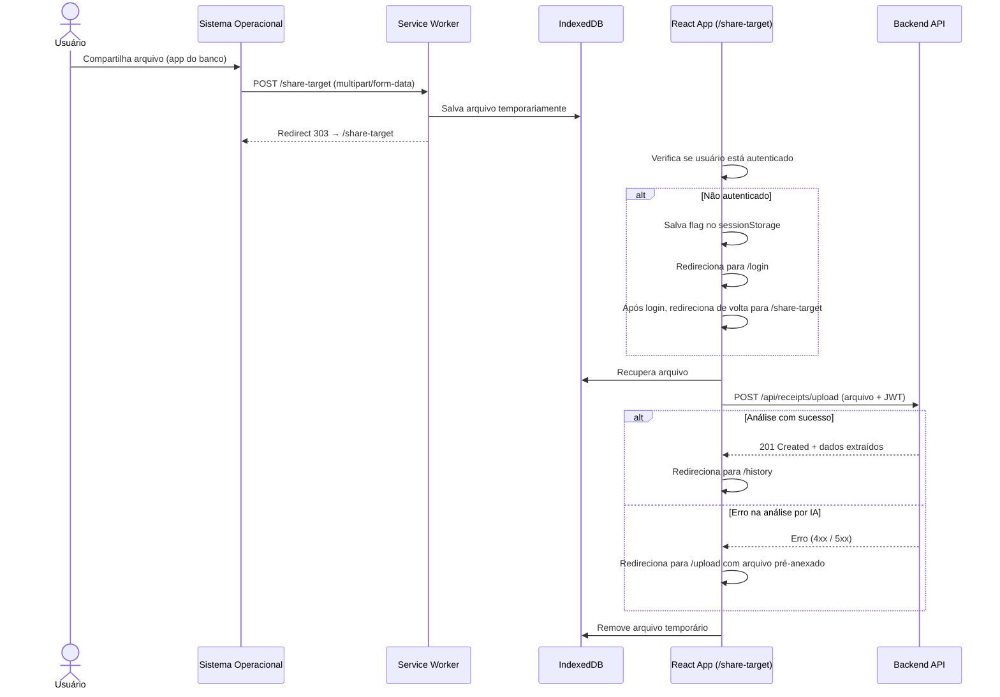

# TDD - PWA Share Target: Recebimento de Arquivos via Compartilhamento

| Campo           | Valor                                        |
| --------------- | -------------------------------------------- |
| Tech Lead       | @Tiago                                       |
| Time            | Tiago (solo)                                 |
| Epic/Ticket     | -                                            |
| Status          | Implemented                                  |
| Criado em       | 2026-03-26                                   |
| Última Revisão  | 2026-03-26                                   |

---

## Contexto

O ReceipTV é um gerenciador de recibos financeiros com extração por IA. Atualmente, o usuário precisa acessar o app e fazer upload manual do arquivo (imagem ou PDF) pela tela de upload.

O app já é uma SPA (React + Vite) servida via web. A infraestrutura mobile é baseada em PWA, o que permite integração com o sistema operacional de compartilhamento (Share Sheet) do Android e iOS sem necessidade de publicar um app nativo nas stores.

**Domínio:** Captura de recibo — ponto de entrada de dados financeiros do usuário.

**Stakeholders:** Usuário final (pessoa física que realiza pagamentos via app de banco e deseja registrar automaticamente os comprovantes).

---

## Definição do Problema e Motivação

### Problemas que Estamos Resolvendo

- **Fluxo de upload é manual e fragmentado**: O usuário precisa salvar o comprovante no dispositivo, abrir o ReceipTV, navegar até a tela de upload e selecionar o arquivo — múltiplos passos desnecessários.
  - Impacto: Fricção alta leva ao abandono do registro. Comprovantes ficam perdidos na galeria.

- **Contexto de uso é externo ao app**: O comprovante é gerado no app do banco. O usuário já está com o arquivo em mãos naquele momento. Voltar ao ReceipTV quebra o fluxo natural.
  - Impacto: Taxa de registro de comprovantes abaixo do potencial real.

### Por que agora?

- O ReceipTV já possui o backend de análise por IA funcionando. O gargalo é a captura do arquivo.
- A Web Share Target API está madura no Android (Chrome), permitindo implementação sem desenvolvimento nativo.
- Melhoria de UX de alto impacto com esforço relativamente baixo.

### Impacto de NÃO Resolver

- **Usuário**: Continua com fluxo manual tedioso, tendência a não registrar comprovantes.
- **Produto**: Menor engajamento, valor percebido reduzido frente a apps nativos.

---

## Escopo

### ✅ In Scope (V1 - MVP)

- Configuração do PWA para receber compartilhamentos de arquivos (imagens e PDFs)
- Suporte prioritário a **Android** (Chrome)
- Suporte a **iOS** com as limitações do Safari (ver Riscos)
- Verificação de autenticação antes de processar o arquivo
- Persistência temporária do arquivo (IndexedDB) para sobreviver redirect de login
- Envio automático do arquivo para análise por IA ao receber o compartilhamento
- Em caso de erro na IA: redirecionamento para a tela de upload manual com o arquivo pré-anexado
- Feedback visual durante o processamento (loading, erro, sucesso)

### ❌ Out of Scope (V1)

- Fila de processamento assíncrono (o envio é síncrono na V1)
- Recebimento de múltiplos arquivos em um único compartilhamento
- Compartilhamento de texto puro ou URLs (somente arquivos binários)
- App nativo (iOS App Store / Google Play)
- Publicação como PWA instalável em lojas (PWA Builder, etc.)
- Notificações push ao finalizar análise

### 🔮 Considerações Futuras (V2+)

- Fila offline com sync quando voltar a ter conexão
- Suporte a múltiplos arquivos por compartilhamento
- Notificação push com resultado da IA

---

## Estado Atual da Implementação

### ✅ Já Implementado

| Item | Arquivo | Observação |
| ---- | ------- | ---------- |
| Manifest PWA base | `client/vite.config.js` (via `VitePWA`) | `display: standalone`, `start_url: /`, ícones SVG configurados |
| `share_target` no manifest | `client/vite.config.js` | `action: /share-target`, POST, `multipart/form-data`, aceita JPEG/PNG/WebP/PDF |
| Service Worker (injectManifest) | `client/src/sw.js` | Workbox precaching + navegação SPA + cache fontes + handler de share target |
| Handler de share no SW | `client/src/sw.js` | Intercepta POST `/share-target`, valida tipo/tamanho, salva no IndexedDB, retorna 303 |
| Helper IndexedDB (SW) | `client/src/sw.js` | `openShareDB`, `savePendingShare` com chave por timestamp |
| Helper IndexedDB (cliente) | `client/src/utils/shareIdb.js` | `getPendingShare`, `deletePendingShare` com verificação de expiração (30min) |
| Rota `/share-target` | `client/src/pages/ShareTargetPage.jsx` + `App.jsx` | Orquestra leitura do IDB, upload via API, redirect sucesso/erro |
| Redirect pós-login | `client/src/components/ProtectedRoute.jsx` + `client/src/pages/LoginPage.jsx` | Salva `redirect_after_login` no `sessionStorage`; LoginPage lê e redireciona após autenticação |
| Recebimento de arquivo via `location.state` | `client/src/pages/UploadPage.jsx` | Pré-preenche arquivo (`sharedFile`) e exibe erros de share (`shareError`) vindos do state ou query params |
| Prompt de instalação do PWA | `client/src/components/PWAPrompts.jsx` | Banner de instalação com `beforeinstallprompt` + dismiss persistido em `sessionStorage` |
| Banner de atualização do SW | `client/src/components/PWAPrompts.jsx` | Usa `useRegisterSW` do `vite-plugin-pwa/react` |
| Página offline | `client/public/offline.html` | Fallback quando sem conexão |
| Web Share API (saída) | `client/src/pages/UploadPage.jsx` | Compartilhamento de comprovantes via `navigator.share()` — **diferente** do Share Target |

---

## Solução Técnica

### Visão Geral da Arquitetura

O mecanismo é baseado na **Web Share Target API** (Level 2 — suporte a arquivos). O PWA registra no manifest que aceita compartilhamentos de arquivos. Quando o usuário compartilha um arquivo de outro app (ex: banco), o sistema operacional apresenta o ReceipTV como destino. O arquivo é recebido via POST pelo Service Worker, que o armazena temporariamente no IndexedDB e redireciona o usuário para a rota de processamento dentro do app.

**Componentes-chave:**

- **Web App Manifest** (via `vite.config.js` → `VitePWA`): Declara a capacidade `share_target` com action, method e campo do arquivo.
- **Service Worker customizado** (`client/public/sw.js` + modo `injectManifest`): Intercepta o POST de compartilhamento, extrai o arquivo, persiste no IndexedDB e redireciona para `/share-target`. **Requer migração do modo `generateSW` para `injectManifest`** (ver Decisões Técnicas).
- **Rota `/share-target`** (nova página React): Orquestra o fluxo — verifica autenticação, recupera o arquivo do IndexedDB, chama a API e trata sucesso/erro.
- **Backend existente** (`POST /api/receipts/upload`): Nenhuma alteração necessária. Já suporta upload de imagem/PDF com análise por IA.

### Diagrama de Fluxo



### Decisões Técnicas

#### Migração para modo `injectManifest` (vite-plugin-pwa)

O Service Worker atual é gerado automaticamente pelo Workbox no modo `generateSW`. **Este modo não permite adicionar handlers customizados** (como o interceptador do POST de share target). É necessário migrar para o modo `injectManifest`, que:

1. Usa um arquivo SW base customizado (`client/src/sw.js`)
2. O Workbox injeta o precache manifest nesse arquivo em tempo de build
3. Permite adicionar qualquer lógica adicional no SW (ex: handler de share target)

**Mudança necessária no `vite.config.js`:**

```js
VitePWA({
  // Antes:
  // workbox: { ... }

  // Depois:
  strategies: 'injectManifest',
  srcDir: 'src',
  filename: 'sw.js',
  injectManifest: {
    globPatterns: ['**/*.{js,css,html,svg,ico,woff2}'],
  },
})
```

O arquivo `client/src/sw.js` conterá tanto o código do Workbox (precaching, navegação) quanto o handler do share target.

#### Ícones do PWA

O manifest atual usa apenas ícones SVG. Para máxima compatibilidade (especialmente Android), recomenda-se adicionar ícones PNG rasterizados (192x192 e 512x512). Contudo, por ser uma decisão de escopo de design, fica como melhoria opcional para V1.

### Configuração do Web App Manifest

Adicionar entrada `share_target` na configuração `manifest` do `VitePWA` em `vite.config.js`:

```js
manifest: {
  // ... campos existentes mantidos ...
  share_target: {
    action: '/share-target',
    method: 'POST',
    enctype: 'multipart/form-data',
    params: {
      files: [
        {
          name: 'file',
          accept: ['image/jpeg', 'image/png', 'image/webp', 'application/pdf'],
        },
      ],
    },
  },
},
```

**Restrição importante:** O `action` deve ser uma URL dentro do escopo do PWA (mesmo origin). O Service Worker intercepta este POST antes que chegue ao servidor.

### Persistência Temporária no IndexedDB

O arquivo é armazenado no IndexedDB com uma chave baseada em timestamp (para evitar conflito entre abas) enquanto o usuário passa pelo fluxo de autenticação. Após o processamento (sucesso ou erro na IA), o registro é removido.

**Schema do objeto armazenado:**

```json
{
  "file": "<Blob>",
  "filename": "comprovante.pdf",
  "mimeType": "application/pdf",
  "savedAt": "2026-03-26T10:00:00Z"
}
```

O IndexedDB não tem uso atual no projeto — será o primeiro ponto de uso.

### Fluxo de Autenticação

Se o usuário não estiver logado no momento do compartilhamento:
1. A rota `/share-target` detecta ausência de token JWT
2. Armazena no `sessionStorage` a flag `redirect_after_login=/share-target`
3. Redireciona para `/login`
4. Após login bem-sucedido, o `ProtectedRoute` ou o handler de login lê a flag e redireciona de volta para `/share-target`

**Importante:** O arquivo já está no IndexedDB, então não é perdido durante o redirect.

O componente `ProtectedRoute` atual (`client/src/components/ProtectedRoute.jsx`) precisará ser adaptado para ler e limpar a flag de redirect pós-login.

### Fallback para Upload Manual

Em caso de erro na análise por IA, o usuário é redirecionado para `/upload`. A tela de upload (`UploadPage.jsx`) deve ser adaptada para receber o arquivo via estado de navegação (React Router `location.state`) e pré-preencher o campo de arquivo. Isso evita que o usuário precise selecionar o arquivo manualmente de novo.

### APIs e Endpoints

Nenhum endpoint novo é necessário no backend. O fluxo utiliza o endpoint existente:

| Endpoint                    | Método | Descrição                          | Request                | Response                  |
| --------------------------- | ------ | ---------------------------------- | ---------------------- | ------------------------- |
| `POST /api/receipts/upload` | POST   | Upload de recibo com análise por IA | `multipart/form-data` com campo `file` + JWT no header | `201` com dados extraídos ou erro |

### Alterações no Banco de Dados

Nenhuma alteração necessária.

---

## Riscos

| Risco | Impacto | Probabilidade | Mitigação |
| ----- | ------- | ------------- | --------- |
| **iOS Safari suporte limitado a arquivos via Share Target** | Alto — funcionalidade não disponível no iOS | Alto | Documentar limitação claramente. No iOS, o usuário continuará usando o upload manual. Considerar Web Share Target apenas para Android na V1. |
| **PWA não instalado = sem acesso ao Share Sheet** | Alto — funcionalidade invisível para usuários que não instalaram o PWA | Médio | `PWAPrompts.jsx` já exibe banner de instalação. Garantir que o banner apareça em todas as telas principais. |
| **Migração `generateSW` → `injectManifest` quebra SW existente** | Alto — pode invalidar o precache e deixar usuários sem offline | Médio | Testar a migração isoladamente antes de adicionar o handler de share. Validar que o precaching e a navegação offline continuam funcionando. |
| **Arquivo expirado no IndexedDB** | Médio — se usuário demorar muito para fazer login, o arquivo pode ser inconsistente | Baixo | Verificar `savedAt` ao recuperar: se mais de 30 minutos, descartar e redirecionar para `/upload` com mensagem. |
| **Service Worker em estado desatualizado** | Médio — versão antiga do SW pode não suportar a rota de share target | Médio | `registerType: 'prompt'` já está configurado. `PWAPrompts.jsx` já exibe banner de atualização. Garantir que usuários atualizem antes de usar share target. |
| **Arquivo muito grande** | Médio — PDFs pesados podem falhar no IndexedDB ou na API | Baixo | Validar tamanho máximo no SW antes de salvar (limite: 10MB, igual ao backend via multer). Exibir erro claro se exceder. |
| **Conflito de `pending-share` entre abas** | Baixo — dois compartilhamentos simultâneos podem sobrescrever o dado | Muito Baixo | Usar chave única por timestamp no IndexedDB. |

---

## Plano de Implementação

| Fase | Tarefa | Descrição | Status | Estimativa |
| ---- | ------ | --------- | ------ | ---------- |
| **Fase 1 - PWA Base** | Auditar manifest atual | PWA já configurado corretamente: `display: standalone`, `start_url: /`, ícones SVG, `PWAPrompts` com install/update | ✅ DONE | — |
| | Adicionar `share_target` ao manifest | Entrada adicionada em `vite.config.js` no campo `manifest` do `VitePWA` | ✅ DONE | — |
| **Fase 2 - Service Worker** | Migrar para modo `injectManifest` | `vite.config.js` migrado para `strategies: 'injectManifest'`; criado `client/src/sw.js` | ✅ DONE | — |
| | Implementar handler de share | SW intercepta POST `/share-target`, valida tipo/tamanho, salva no IndexedDB, retorna 303 | ✅ DONE | — |
| | Helper IndexedDB | `client/src/utils/shareIdb.js` com `getPendingShare` e `deletePendingShare` + expiração de 30min | ✅ DONE | — |
| **Fase 3 - Rota React** | Criar página `/share-target` | `ShareTargetPage.jsx`: lê IDB, chama API, redireciona para `/history` (sucesso) ou `/upload` (erro) | ✅ DONE | — |
| | Registrar rota em `App.jsx` | `<Route path="share-target" element={<ShareTargetPage />} />` adicionado | ✅ DONE | — |
| | Integrar fluxo de auth | `ProtectedRoute` salva `redirect_after_login`; `LoginPage` lê e redireciona após autenticação | ✅ DONE | — |
| | Fallback para upload manual | `navigate('/upload', { state: { sharedFile } })` em caso de erro na IA | ✅ DONE | — |
| **Fase 4 - Tela de Upload** | Receber arquivo via state | `UploadPage.jsx` lê `location.state.sharedFile` e `location.state.shareError` + `?share_error` query param | ✅ DONE | — |
| **Fase 5 - Testes** | Testes funcionais Android | Testar fluxo completo em Android Chrome (usuário logado, não logado, erro de IA) | TODO | 1d |
| | Testes iOS | Verificar comportamento no Safari iOS e documentar limitações | TODO | 0,5d |
| | Testes de edge cases | Arquivo grande, SW desatualizado, sem conexão | TODO | 0,5d |

**Estimativa Restante:** ~2 dias (somente testes)

---

## Considerações de Segurança

### Autenticação

- O arquivo nunca é enviado ao backend sem um JWT válido.
- O JWT é verificado pelo backend no endpoint existente (sem alterações necessárias).
- O arquivo fica no IndexedDB do dispositivo do usuário — não é exposto a outros origins.

### Validação de Arquivo

- **Tipo MIME:** Validar no manifest (`accept`) e no Service Worker antes de salvar no IndexedDB. Tipos permitidos: `image/jpeg`, `image/png`, `image/webp`, `application/pdf`.
- **Tamanho:** Rejeitar arquivos acima de 10MB (limite já existente no backend via `multer`).
- **Nome do arquivo:** Sanitizar o nome antes de enviar ao backend (evitar path traversal).

### IndexedDB

- Os dados ficam no storage local do browser, acessíveis apenas pelo mesmo origin (ReceipTV).
- O arquivo é deletado imediatamente após o processamento (sucesso ou erro).
- Não persistir dados sensíveis além do arquivo em si.

### HTTPS

- Web Share Target requer que o PWA esteja servido via HTTPS (obrigatório para Service Worker).
- O ambiente de produção (`receiptv.onrender.com`) já usa HTTPS via Render.

---

## Estratégia de Testes

| Tipo | Escopo | Cenários Críticos |
| ---- | ------ | ----------------- |
| **Funcional Manual (Android)** | Fluxo E2E via Share Sheet | Usuário logado compartilha PDF → análise bem-sucedida → vai para /history |
| **Funcional Manual (Android)** | Fluxo com auth | Usuário não logado compartilha arquivo → faz login → análise executada automaticamente |
| **Funcional Manual (Android)** | Fallback de erro | IA retorna erro → usuário vai para /upload com arquivo pré-anexado |
| **Funcional Manual (iOS)** | Verificação de suporte | Documentar se Share Target funciona no Safari iOS atual |
| **Testes de Borda** | Arquivo grande (> 10MB) | Exibir mensagem de erro clara, não crashar o SW |
| **Testes de Borda** | SW desatualizado | Forçar atualização e verificar que o handler funciona |
| **Testes de Borda** | Arquivo no IndexedDB expirado (> 30min) | Redirecionar para /upload com mensagem explicativa |
| **Regressão** | Migração `injectManifest` | Verificar que precaching, navegação offline e `PWAPrompts` continuam funcionando após a migração |

### Ambiente de Teste

- Usar `ngrok` apontando para `localhost:5173` (Vite dev server) ou deploy em staging para testar Share Target (não funciona em `localhost` no dispositivo físico sem HTTPS).
- Testar em dispositivo físico Android — emuladores têm limitações com Share Sheet.
- O SW está desativado em dev (`devOptions.enabled: false` no `vite.config.js`) — testar via `npm run build && npm run preview` ou staging.

---

## Dependências

| Dependência | Tipo | Status | Observação |
| ----------- | ---- | ------ | ---------- |
| HTTPS no ambiente de produção | Infraestrutura | ✅ OK | `receiptv.onrender.com` já usa HTTPS via Render |
| HTTPS no ambiente de staging | Infraestrutura | 🔴 Verificar | Necessário para testar Share Target em dispositivo físico |
| PWA instalável (manifest completo com icons) | Frontend | ✅ OK | Manifest com `display: standalone`, ícones SVG e `PWAPrompts` já implementado |
| Migração SW para modo `injectManifest` | Frontend | 🔴 A implementar | Pré-requisito para handler customizado no SW |
| Endpoint `POST /api/receipts/upload` | Backend | ✅ OK | Existente e funcional, sem alterações necessárias |
| Tela de upload (`/upload`) aceitar arquivo via `location.state` | Frontend | 🔴 A implementar | Pequena adaptação em `UploadPage.jsx` |

---

## Questões em Aberto

| # | Questão | Status |
| - | ------- | ------ |
| 1 | O PWA atual já tem manifest com `display: standalone` e ícones adequados para ser instalável? | ✅ Resolvido — sim, `display: standalone`, `start_url: /`, ícones SVG e `PWAPrompts` com install prompt |
| 2 | O ambiente de produção já usa HTTPS? | ✅ Resolvido — `receiptv.onrender.com` usa HTTPS via Render |
| 3 | O ambiente de staging usa HTTPS? | 🔴 Verificar |
| 4 | Como comunicar ao usuário iOS a limitação do Share Target? (banner, FAQ, etc.) | 🟡 A decidir |
| 5 | Qual o comportamento desejado se o usuário compartilhar um tipo de arquivo não suportado (ex: `.xlsx`)? | 🟡 A decidir |
| 6 | Adicionar ícones PNG rasterizados (192x192, 512x512) além do SVG para melhor compatibilidade no Android? | 🟡 A decidir (melhoria opcional) |

---

## Notas sobre Suporte por Plataforma

| Plataforma | Suporte | Observação |
| ---------- | ------- | ---------- |
| Android (Chrome 76+) | ✅ Completo | Suporte total a arquivos via Share Target Level 2 |
| Android (outros browsers) | ⚠️ Parcial | Samsung Internet suporta; Firefox Android não suporta Share Target |
| iOS (Safari 16.4+) | ⚠️ Limitado | Share Target funciona para texto/URLs; suporte a **arquivos** é instável e depende da versão do iOS |
| iOS (Chrome, Firefox) | ❌ Não suportado | Browsers no iOS usam o engine do Safari; sem suporte a Service Worker completo |
| Desktop (Chrome) | ✅ Funcional | Pode ser testado via drag-and-drop no Share Sheet do Windows/macOS |
