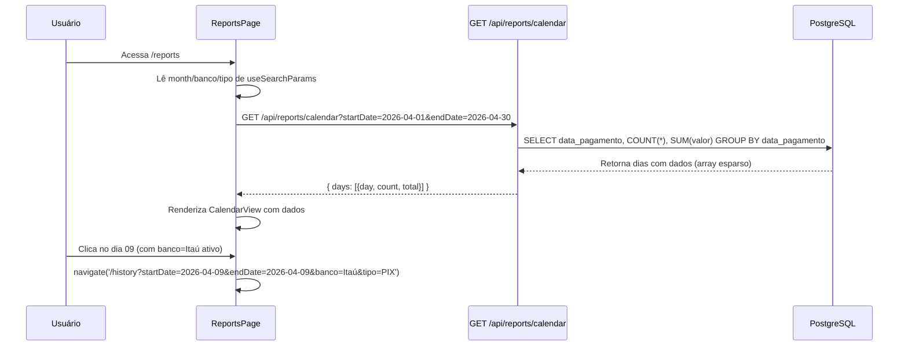

# TDD - Visualização em Calendário na Página de Relatórios

| Campo          | Valor                        |
| -------------- | ---------------------------- |
| Tech Lead      | Tiago Vazzoller              |
| Time           | Tiago Vazzoller              |
| Epic/Ticket    | —                            |
| Status         | Aprovado                     |
| Criado em      | 2026-04-09                   |
| Última revisão | 2026-04-09                   |

---

## Contexto

O ReceipTV é um gerenciador financeiro de recibos com extração por IA. Atualmente, a seção de relatórios é composta pela `DashboardPage` (rota `/`), que exibe KPIs e gráficos agregados por mês e por banco/tipo de pagamento, e pela `HistoryPage` (rota `/history`), que lista recibos individuais com filtros avançados.

Não existe uma página de relatórios dedicada (`/reports`). O usuário não tem uma forma de visualizar seus gastos em formato de calendário — uma visão temporal que permite identificar rapidamente em quais dias do mês houve mais transações ou maior volume financeiro.

**Domínio:** análise de gastos / relatórios financeiros.

**Stakeholder principal:** o próprio usuário final, que quer uma visão rápida e intuitiva de seus gastos ao longo do mês.

---

## Definição do Problema

### Problemas a Resolver

- **Ausência de visão temporal por dia:** O usuário não consegue identificar padrões de gasto diário (ex: "todo dia 10 gasto muito") sem navegar recibo por recibo no histórico.
- **Falta de página de relatórios dedicada:** Atualmente, KPIs e gráficos estão misturados no Dashboard. Uma página `/reports` separada cria espaço para múltiplos modos de visualização analítica.

### Por Que Agora?

- O backend já possui todos os dados necessários (coluna `data_pagamento DATE` + índice em `user_id, data_pagamento`).
- A HistoryPage já suporta filtros por `startDate`/`endDate` via URL search params, tornando a integração "ao clicar no dia" trivial.
- Nenhuma nova dependência de biblioteca é necessária (date-fns v4 já instalado).

### Impacto de Não Resolver

- **Usuário:** perde uma visão analítica valiosa disponível em praticamente todos os apps de gestão financeira.
- **Produto:** o app não evolui além de upload + listagem simples.

---

## Escopo

### ✅ Em Escopo (V1)

- Nova rota `/reports` com `ReportsPage`
- Visualização em calendário mostrando **quantidade de recibos** e **valor total** por dia
- Navegação entre meses (anterior/próximo)
- Filtros de **banco** e **tipo de pagamento** persistidos em URL search params (`?month=&banco=&tipo=`)
- Ao clicar em um dia: navegar para `/history?startDate=YYYY-MM-DD&endDate=YYYY-MM-DD&banco=Y&tipo=Z` (todos os filtros ativos são repassados)
- Link de acesso via **DashboardPage** (card/link visível para mobile) e **Sidebar** (desktop)
- Novo endpoint backend: `GET /api/reports/calendar`
- Layout **mobile-first**: célula compacta (número + badge colorido) no mobile, expandida (número + count + valor) no desktop (`md:`)

### ❌ Fora de Escopo (V1)

- Outros modos de visualização (gráfico de barras, heatmap avançado) — futuros
- Adição de "Relatórios" ao BottomNav mobile (já possui 5 itens; adicionar um 6º degradaria a UX)
- Filtros de `valorMin`/`valorMax`/`nome` no calendário (granulares demais para visão agregada)
- Exportação PDF/ZIP a partir da visão de calendário
- Heatmap de intensidade proporcional ao valor (V2)

### 🔮 Futuro (V2+)

- Outros modos de visualização na `ReportsPage` (gráfico de linha temporal, heatmap)
- Heatmap colorido com intensidade proporcional ao valor
- Adicionar "Relatórios" ao BottomNav se o layout mobile for reestruturado

---

## Solução Técnica

### Visão Geral da Arquitetura

```
ReportsPage (/reports)
├── Filtros (banco, tipo, mês) → URL search params
├── CalendarView
│   └── CalendarDayCell × N (grid 7 colunas)
│       ├── Mobile: número do dia + badge (count)
│       └── Desktop (md:): número + count + valor formatado
│           └── onClick → navigate('/history?startDate=X&endDate=X&banco=Y&tipo=Z')
└── API: GET /api/reports/calendar?startDate=&endDate=&banco=&tipoPagamento=
```



### Componentes e Arquivos

**Novos arquivos:**

| Arquivo | Responsabilidade |
|---|---|
| `client/src/pages/ReportsPage.tsx` | Página principal: gerencia filtros (URL params), busca dados, renderiza CalendarView |
| `client/src/components/CalendarView.tsx` | Grid 7×N semanas com cabeçalho de dias da semana e navegação entre meses |
| `client/src/components/CalendarDayCell.tsx` | Célula individual: número do dia, badge de count, valor formatado; emite `onClick` |

**Arquivos existentes a modificar:**

| Arquivo | Alteração |
|---|---|
| `client/src/App.tsx` | Adicionar rota `/reports` dentro do Layout protegido |
| `client/src/components/Sidebar.tsx` | Adicionar link "Relatórios" na navegação desktop |
| `client/src/pages/DashboardPage.tsx` | Adicionar link/card "Ver Calendário" para acesso mobile |
| `client/src/api/services.ts` | Adicionar função `getCalendarData(params)` |
| `client/src/types/` | Adicionar interfaces `CalendarDayData` e `CalendarResponse` |
| `server/src/routes/reports.ts` | Adicionar endpoint `GET /calendar` |

### Endpoint Backend

**`GET /api/reports/calendar`**

| Parâmetro | Tipo | Obrigatório | Descrição |
|---|---|---|---|
| `startDate` | `string` YYYY-MM-DD | Sim | Primeiro dia do intervalo visível |
| `endDate` | `string` YYYY-MM-DD | Sim | Último dia do intervalo visível |
| `banco` | `string` | Não | Filtrar por banco |
| `tipoPagamento` | `string` | Não | Filtrar por tipo de pagamento |

**Exemplo de request:**
```
GET /api/reports/calendar?startDate=2026-04-01&endDate=2026-04-30&banco=Itaú
Authorization: Bearer <jwt>
```

**Exemplo de response `200 OK`:**
```json
{
  "days": [
    { "day": "2026-04-01", "count": 3, "total": 450.75 },
    { "day": "2026-04-09", "count": 5, "total": 1830.50 }
  ]
}
```

> Apenas dias **com recibos** são retornados (array esparso). O frontend preenche os demais dias como vazios.

**Query SQL (com filtros dinâmicos via `conditions[]` + `params[]`):**
```sql
SELECT
  data_pagamento::text AS day,
  COUNT(*)::int        AS count,
  SUM(valor)           AS total
FROM receipts
WHERE user_id = $1
  AND data_pagamento BETWEEN $2 AND $3
  -- AND LOWER(banco) = $N  (se banco informado)
  -- AND LOWER(tipo_pagamento) = $N  (se tipoPagamento informado)
GROUP BY data_pagamento
ORDER BY data_pagamento ASC
```

**Índice já existente:** `idx_receipts_user_date (user_id, data_pagamento)` — cobre perfeitamente esta query.

### Gerenciamento de Estado no Frontend

**URL search params (source of truth):** `?month=2026-04&banco=Itaú&tipo=PIX`

**Estado local (useState):**
- `calendarData: CalendarDayData[]` — dados da API
- `loading: boolean`

**Navegação ao clicar no dia (com todos os filtros ativos):**
```
navigate(`/history?startDate=${day}&endDate=${day}&banco=${banco}&tipo=${tipo}`)
```
> Apenas os filtros com valor são incluídos. Sem alteração na `HistoryPage`.

### Design Visual

**Mobile (< `md:`):** células compactas — número do dia no topo + badge colorido indicando presença de dados.

**Desktop (`md:`):** células expandidas — número do dia + contagem de recibos + valor formatado (`formatCurrency`).

**Paleta:**
- Dias com recibos: `bg-green-500/20`, badge `bg-green-500`
- Dia de hoje: `ring-1 ring-green-500/50`
- Dias sem dados: `bg-zinc-800/50`
- Hover: `hover:bg-zinc-700 transition-colors`
- Dias de mês anterior/próximo: opacidade reduzida (`opacity-40`)

**Implementação:** grid manual com Tailwind (`grid grid-cols-7`) + `date-fns` v4 (já instalado). Não usar `react-day-picker`.

### Banco de Dados

**Nenhuma migração necessária.** A tabela `receipts` já possui `data_pagamento DATE` e o índice `idx_receipts_user_date (user_id, data_pagamento)`.

---

## Riscos

| Risco | Impacto | Probabilidade | Mitigação |
|---|---|---|---|
| BottomNav mobile com 6 itens → UX degradada | Médio | Alto | **Não adicionar ao BottomNav**; acessar via card na DashboardPage + Sidebar desktop |
| CalendarDayCell muito pequena em mobile para exibir count + valor | Médio | Alto | No mobile, exibir apenas número + badge colorido; valores apenas em `md:` |
| `startDate`/`endDate` não informados no endpoint → full table scan | Alto | Baixo | Validar obrigatoriedade no backend; retornar 400 se ausentes |
| Range de datas muito amplo → query lenta | Médio | Baixo | Limitar range a no máximo 366 dias; o frontend envia apenas 1 mês por vez |

---

## Plano de Implementação

| Fase | Tarefa | Descrição | Estimativa |
|---|---|---|---|
| **1 — Backend** | Endpoint `/calendar` | Handler em `reports.ts` com query dinâmica, validação, Swagger e log de erro | 2h |
| **2 — Frontend: infra** | Rota `/reports` + Sidebar | Rota em `App.tsx` + link na `Sidebar` | 30min |
| **2 — Frontend: infra** | Tipos e serviço | `CalendarDayData`, `CalendarResponse`, `getCalendarData()` | 30min |
| **3 — Frontend: componentes** | `CalendarDayCell` | Célula responsiva mobile/desktop | 1h |
| **3 — Frontend: componentes** | `CalendarView` | Grid 7 colunas, navegação prev/next, cabeçalho | 2h |
| **4 — Frontend: página** | `ReportsPage` | Filtros em URL params, chamada API, loading/empty states | 1.5h |
| **5 — Integração** | Navegação + DashboardPage | Testar click → HistoryPage com todos os filtros; card na DashboardPage | 30min |

**Estimativa total:** ~1 dia de trabalho.

---

## Considerações de Segurança

- **Autenticação:** endpoint protegido pelo middleware JWT `auth` — usuário só acessa os próprios dados via `user_id` do token.
- **SQL Injection:** prepared statements (`$1`, `$2`, ...) com padrão `conditions[]` + `params[]` de `receipts.ts`.
- **Validação de entrada:** `startDate` e `endDate` obrigatórios e no formato `YYYY-MM-DD`; `startDate ≤ endDate`; range máximo 366 dias; retornar 400 se inválidos.
- **Logging:** `logger.error` no catch — nunca expor stack trace ao cliente.

---

## Estratégia de Testes

| Tipo | Escopo | Cenários Críticos |
|---|---|---|
| **Manual (smoke)** | Endpoint `/calendar` | Retorna só dias do usuário; filtros funcionam; 400 sem params obrigatórios |
| **Manual (UI)** | CalendarView | Navegação entre meses; clicar dia → HistoryPage com filtros corretos; mobile vs desktop |
| **E2E (Playwright)** | Fluxo completo | Acessa `/reports` → visualiza calendário → clica dia → HistoryPage filtrada |

---

## Monitoramento e Observabilidade

Sem monitoramento novo crítico além do padrão (Morgan + Winston). Log de erro obrigatório no catch do endpoint.

---

## Plano de Rollback

Feature aditiva (nova rota + novo endpoint). Rollback = reverter o commit. Nenhum dado existente é afetado. HistoryPage e DashboardPage continuam funcionando normalmente.

---

## Dependências

| Dependência | Status |
|---|---|
| `date-fns` v4.1.0 | ✅ Já instalado |
| Índice `idx_receipts_user_date` | ✅ Já existe |
| `HistoryPage` com filtros por URL | ✅ Já implementado |

---

## Questões em Aberto

Todas resolvidas:
- ✅ Navegar com todos os filtros ativos ao clicar no dia
- ✅ Acesso via card na DashboardPage (não no BottomNav)
